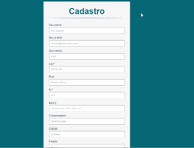

# Cadastro-e-comerce

=======

# Índice
* [Descrição](#descri%C3%A7%C3%A3o)
* [Funcionalidades](#funcionalidade)
* [Tecnologias utilizadas](#tecnologias-utilizadas)
* [Fontes consultadas](#fontes-consultadas)
* [Autores](#autores)
 
 ## Descrição
* Codigo que utiliza um sistema com javascript que simula uma tela de Log-in e cadastro tipo de um e-comerce
* [Voltar para o Índice](#%C3%ADndice)

 
## Funcionalidade
* Preenchimento de endereço só com o CEP
* Botão de Enviar
* Troca de formulário Log-in/Cadastro
* [Voltar para o Índice](#%C3%ADndice)

 
### Tecnologias utilizadas
* `Git`
* `Git Hub`
* `Visual Estudio Code`
* `HTML5`
* `CSS3`
* `JavaScript`
* [Voltar para o Índice](#%C3%ADndice)

 
## Fontes consultadas
* `Git Hub`
* `Curso Técnico TI`
* `Site e-comerce Vz Styles`
* [Voltar para o Índice](#%C3%ADndice)

 
## Autores
* Daniiekkk
* [Voltar para o Índice](#%C3%ADndice)
